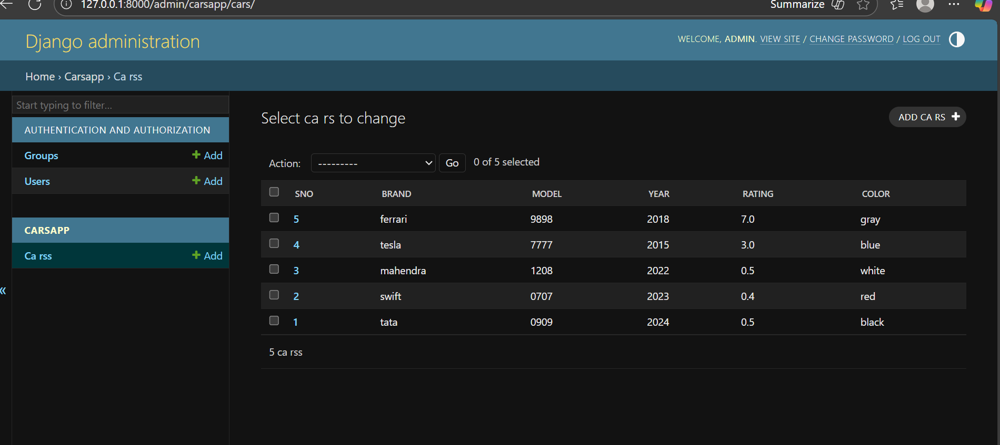

# Ex02 Django ORM Web Application
## Date: 

## AIM
To develop a Django application to store and retrieve data from a Car Inventory Database using Object Relational Mapping(ORM).

## DESIGN STEPS

### STEP 1:
Clone the problem from GitHub

### STEP 2:
Create a new app in Django project

### STEP 3:
Enter the code for admin.py and models.py

### STEP 4:
Execute Django admin and create details for 5 Car 

## PROGRAM


```
models.py
from django.db import models
from django.contrib import admin

class CARs(models.Model):
    SNO = models.CharField(max_length=255, help_text="Car_id")
    Brand = models.CharField(max_length=100, help_text="Brand Name")
    Model = models.CharField(help_text="Model Number")
    Year = models.CharField(max_length=50, help_text="Release Year")
    Rating = models.DecimalField(max_digits=3, decimal_places=1, help_text="Cae Rating (e.g., 8.5)")
    Color = models.CharField(help_text="Car Outer color")

class CARsAdmin(admin.ModelAdmin):
    list_display = ('SNO', 'Brand', 'Model', 'Year', 'Rating','Color')

admin.py
from django.contrib import admin
from.models import CARs,CARsAdmin
admin.site.register(CARs,CARsAdmin)
```

## OUTPUT




## RESULT
Thus the program for creating car inventory database database using ORM hass been executed successfully
